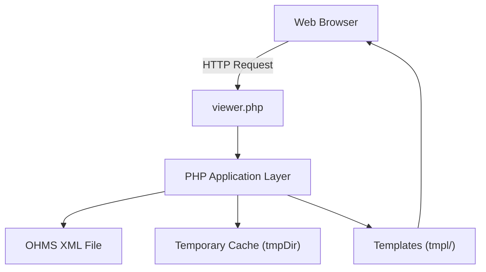
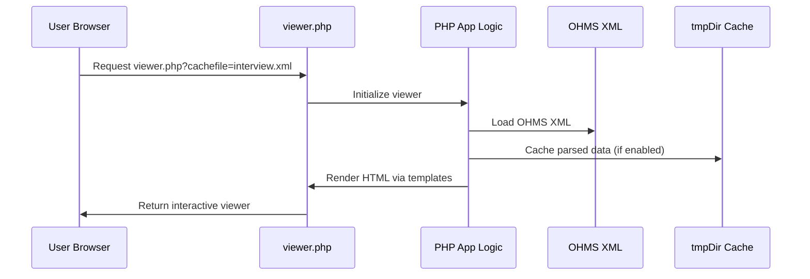

# OHMS Viewer

The **OHMS Viewer** is a lightweight, PHP-based web application for displaying and interacting with Oral History Metadata Synchronizer (OHMS) records. It renders OHMS XML output into a public-facing, media-synchronized interview interface, supporting time-coded transcripts, indexes, and audiovisual playback.

The viewer is typically deployed alongside OHMS XML exports generated by the [Aviary OHMS Application](https//www.aviaryplatform.com) backend and is commonly integrated into digital library platforms, institutional repositories, or custom websites.

---

## Features

* Media playback synchronized with transcripts and indexes
* Support for audio and video interviews
* Time-coded index and transcript display and navigation
* Transcript annotations (both free text and Named-Entity Recognition NER types)
* Searchable interview content
* Configurable branding and styling via CSS
* PHP-based, no database required
* Designed for embedding or standalone use

---

## Quick Start

For users who want to get a working OHMS Viewer instance running as quickly as possible.

### 5-Minute Setup

1. **Download the viewer**

   ```bash
   git clone https://github.com/uklibraries/ohms-viewer.git
   ```

2. **Create your configuration file**

   ```bash
   cp config.template.ini config.ini
   ```

3. **Set permissions**
   Ensure the temporary directory is writable by the web server:

   ```bash
   chmod -R 775 tmp
   ```

4. **Add an OHMS XML file**
   Place a valid OHMS XML export in a directory accessible to the viewer.

5. **Open the viewer**
   In your browser:

   ```text
   https://yourserver/ohms-viewer/viewer.php?cachefile=example.xml
   ```

If the interview media and transcript load successfully, the viewer is ready to use.

---

## Requirements

### Server Requirements

* **PHP 8.x** (PHP 7.4 may work but is not actively tested)
* Apache or Nginx
* Linux or macOS recommended (Windows may work but is not officially supported)

> **Note:** Earlier versions of OHMS Viewer supported PHP 5.x. Current releases include updates for modern PHP versions, including PHP 8 compatibility.

### Bundled Dependencies

The repository includes third-party libraries required for operation, such as:

* jQuery
* jQuery UI
* ECharts
* Multiselect
* ScrollTo
* SimplePagination
* Masonry
* Fancybox
* VideoJS
* WordCloud

No additional package manager (Composer, npm) is required.

---

## Installation

1. **Download or clone the repository**

   ```bash
   git clone https://github.com/uklibraries/ohms-viewer.git
   ```

2. **Create a subdirectory on the web server to store the OHMS Viewer**. If your web server stores pages in /var/www/html and you want to access the viewer as http://example.com/ohms-viewer/, then you would create the subdirectory "ohms-viewer" in /var/www/html/.

3. **Extract the OHMS Viewer zip file** into the subdirectory you created.

4. **Configure the application** (see Configuration section below)

   * Copy `config.template.ini` to `config.ini`
   * Update paths and settings as needed:

     * `tmpDir` (must be writable by the web server)
     * base URL paths
     * optional branding settings

3. **Set file permissions**
   Ensure the temporary directory is writable:

   ```bash
   chmod -R 775 tmp
   ```

4. **Deploy to your web server**
   Place the viewer directory in a web-accessible location and ensure PHP is enabled.

---

## Usage

The viewer is typically invoked by passing an OHMS XML file as a parameter:

```text
viewer.php?cachefile=example.xml
```

The XML file must conform to the OHMS output schema and be accessible to the viewer (either locally or via a configured path).

### Typical Workflow

1. Create interviews and indexes in the OHMS backend
2. Export OHMS XML files
3. Place XML files in a secure directory accessible to the viewer
4. Use the viewer to render interviews for end users

---

## Architecture Overview

OHMS Viewer is a **stateless PHP application** that transforms OHMS XML into a browser-based, interactive interview experience. It does not require a database and relies on the file system and temporary caching.

### High-Level Architecture



### Key Components

* **viewer.php**
  Primary entry point. Parses request parameters and initializes rendering.

* **PHP Application Layer (`app/`)**
  Handles XML parsing, transcript timing, search, and synchronization logic.

* **Templates (`tmpl/`)**
  Control the HTML structure of the viewer interface.

* **Assets (`css/`, `js/`)**
  Styling and client-side interactivity.

* **Temporary Cache (`tmp/`)**
  Stores parsed or transformed XML data for performance.

---

## Data Flow

The viewer operates on a **read-only OHMS XML workflow**, making it safe to deploy without persistent storage.

### Interview Rendering Flow




OHMS Viewer functions strictly as a **presentation layer** and does not replace the OHMS backend.

---

## Configuration and Customization

All runtime configuration is handled via `config.ini`. This configuration file allows you to set the background colors, the usage and Rights statements and images used on the Viewer page. You can refer to the `config.example.ini` in the Viewer subdirectory `config` as a guide for settings values.


Key configuration options include:

1. **Temporary cache directory** (`tmpDir`): Use this field to configure the OHMS Viewer to access the location of your cache files exported from OHMS. The cache files can be located on the same server, inside the Viewer directory, or on another server. To set the server path to access the cache files. Change this line to the server directory path for the cache files. For example, inside the Viewer directory:
   ```txt
   tmpDir = /var/www/html/viewerfiles
   ```
   Or on another webserver:
   ```txt
   tmpDir = http://example.com/cachefiles/
   ```

2. **Repository Name**: Enter name of row 7 in brackets. Replace the existing entry that states *Your Repository Name* with your repository name as entered in the `repository` data field of your cache files. The names must match exactly (the same uppercase or lowercase letters and any punctation).
    ```txt
   [Louie B. Nunn Center for Oral History, University of Kentucky Libraries]
   ```

3. **CSS**: The CSS file name. The default setting is to the `custom_default.css` file located in the `css` subdirectory of the Viewer. Custom styling can be applied by editing or overriding the default CSS files, but we suggest you keep the original file and create a copy for customization. The css file can be used to change the `background` attribute for body, #header, #footer, #audio-panel, or #subjectPlayer to set the background color.

4. **Footer Image**: Set the location for the footer image (such as a logo) that appears in the footer area of the viewer using the `footerimg` property. The image must reside in the root directory of your web site.

5. **Footer Image Alt Text**: Set the alternate text for the footer image that is read by a screen reader using the `footerimgalt` config property.

6. **Contact Email**: Set the contact email address for the `contactemail` config property.

7. **Contact URL**: Set the link to the web site for the repository owner using the `contactlink` property. This may be the same as the URL for your site hosting the Viewer.

8. **Copyright Information**: Set the text describing the copyright holder information using the `copyrightholder` property. If this text will list an entry such as a department or division of an organization, then each entity should be inside the HTML `<span>` tags such as:
    ```txt
   <span>Louie B. Nunn Center for Oral History</span><span>University of Kentucky Libraries</span>
   ```

9. **Open Graph Description**: Set the Open Graph `description` value for the `open_graph_description` property. The Open Graph protocol provides a way for links placed in social media sites to display thumbnail images, descriptions and titles. The `description` is what will always appear as the description for every link to interviews hosted by your OHMS Viewer.

10. **Open Graph Image**: Set the Open Graph image to use for links placed in social media sites with the `open_graph_image` property. This will be the image seen with links placed in social media site postings (it does not appear on the Viewer page). The image must reside in the root directory of your web site.

---

## 🔐 Security Considerations

For production deployments, make sure the following security measures are in place:

* Restrict direct public access to raw OHMS XML files where possible.
* Prevent any public access to `config.ini`.
* Ensure the `tmpDir` directory is **writable by the web server**, but **not executable**.
* Always validate and sanitize any user-supplied parameters when embedding or linking the viewer.

### Apache `.htaccess` Protection

This project already includes a `.htaccess` file in the root directory. It is used to block direct access to sensitive files such as:

- `config.ini`
- Raw `.xml` OHMS files
- Any other internal configuration or data files

You **must make sure** that the path protected in `.htaccess` matches the same directory you configured as `tmpDir` in your `config.ini`.

For example, if your `config.ini` contains:

```ini
tmpDir = "/var/www/html/ohms/cache"
```

Then your .htaccess should protect that same directory (or be placed inside it).

### Example Apache Rule

Here is the rule used in the included `.htaccess` to block direct access to sensitive files and directories.  
In this example, the `tmpDir` is configured as `cache`:

```apache
RewriteRule ^cache(?:/|$) - [R=404,NC,L]
```
---
## Using the Viewer with your OHMS XML files

After installing and configuring the Viewer, you can begin testing and using it immediately. You must have your interview files exported from OHMS in the directory you set for the "tmpDir" configuration property. The URL for using the Viewer would be your web site address and the subdirectory for the Viewer along with the page (viewer.php) that processes the interview file. An example is:

  ```text
   http://www.myviewerexamplesite.edu/viewer/viewer.php?cachefile=name_of_file.xml
  ```
---

## Deployment Notes

* Can be used as a **standalone application** or embedded via iframe
* Works with Apache or Nginx (PHP-FPM recommended)
* Caching behavior depends on the temporary directory size and permissions

---

## Project Structure

```text
ohms-viewer/
├── app/        # Core PHP application logic
├── config/        # Core PHP application logic
   ├── config.ini  # Local configuration (not committed)
   ├── config.template.ini  # configuration template
   ├── config.example.ini  # configuration template with example values
├── css/         # Stylesheets
├── fonts/       # Fonts used for the ohms viewer
├── imgs/        # Images used in the ohms viewer
├── js/          # JavaScript assets
├── lib/         # contains libaries needed for ohms viewer
├── tmpl/        # Templates for rendering the viewer
├── tmp/         # Cache directory (must be writable)
├── vendor/      # Pre installed composer libraries
├── viewer.php   # Main entry point
├── render.php   # Rendering logic
├── index.php    # root php file

```

---


## Releases and Versioning

This repository has an active release history with ongoing maintenance.

* See **GitHub Releases** for version-specific changes and PHP compatibility updates
* Review release notes before upgrading, especially across PHP major versions

---

## License

This project is released under the terms specified in the repository’s license file.

---

## Additional Resources

* Oral History Metadata Synchronizer (OHMS): [https://www.oralhistoryonline.org/](https://www.oralhistoryonline.org/)
* [OHMS in Aviary User Documentation](https://coda.aviaryplatform.com/ohms-in-aviary-115)
* [OHMS Application free subscription to Aviary](https://www.aviaryplatform.com/pricing)
* [OHMS Google Group](https://groups.google.com/u/2/g/ohms) (requires permission to join)
* OHMS Viewer Releases: see the repository’s **Releases** section